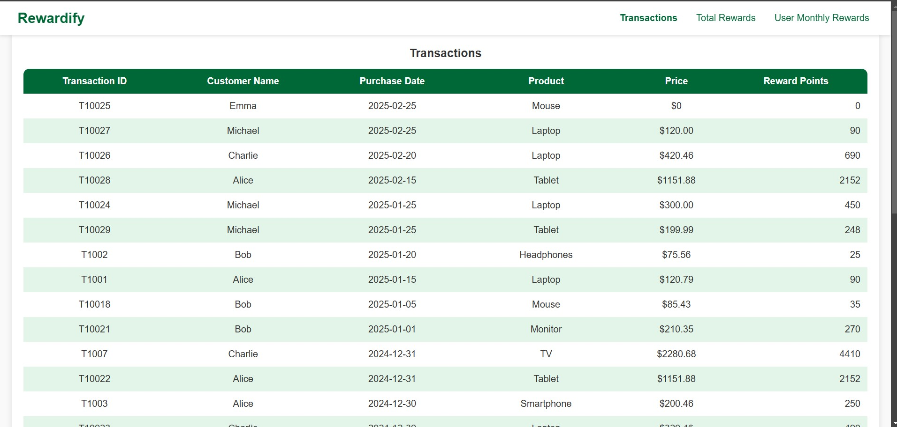
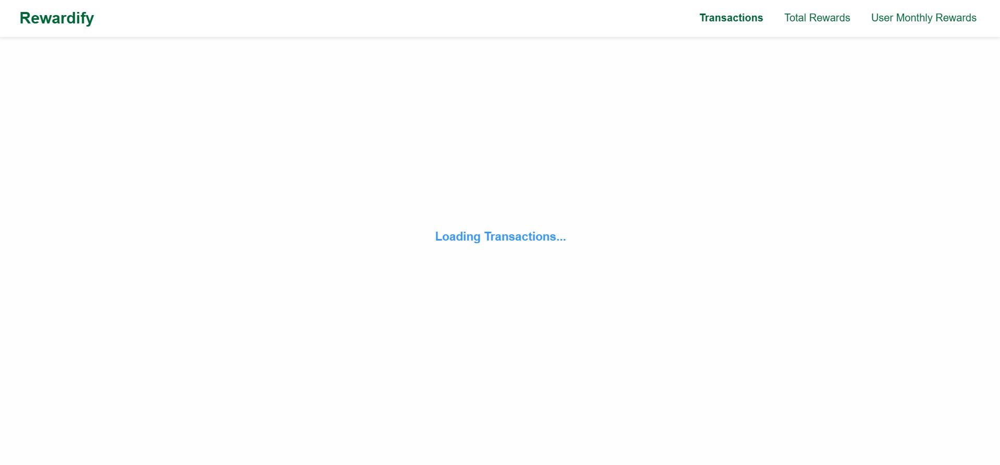
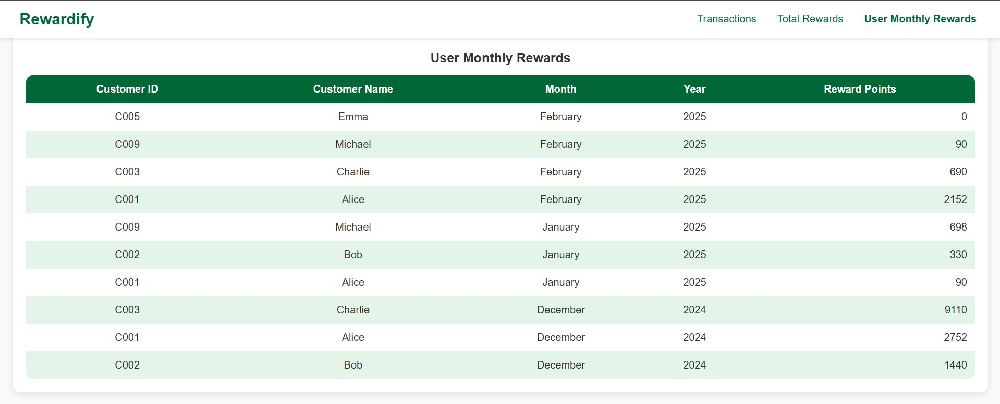
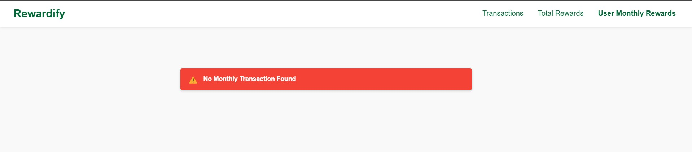
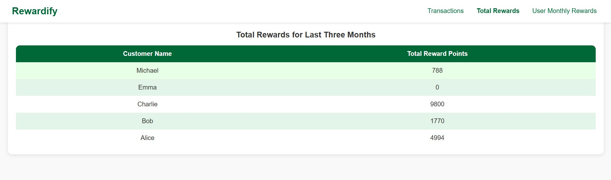
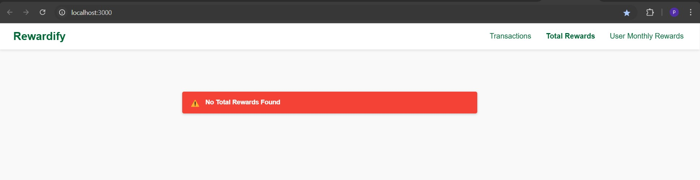
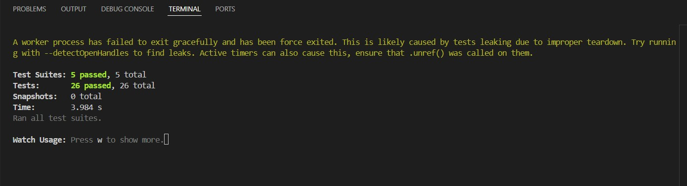

# Getting Started with Create React App

This project was bootstrapped with [Create React App](https://github.com/facebook/create-react-app).

## Available Scripts

In the project directory, you can run:

### `npm start`

Runs the app in the development mode.\
Open [http://localhost:3000](http://localhost:3000) to view it in your browser.

The page will reload when you make changes.\
You may also see any lint errors in the console.

### `npm test`

Launches the test runner in the interactive watch mode.\
See the section about [running tests](https://facebook.github.io/create-react-app/docs/running-tests) for more information.

# Project Description

A retailer offers a rewards program to its customers, awarding points based on each recorded purchase. A customer receives 2 points for every dollar spent over $100 in each transaction, plus 1 point for every dollar spent between $50 and $100 in each transaction. (e.g. a $120 purchase = 2*$20 + 1*$50=90 points). It displays total and monthly rewards for each customer.

# App Component

The App component serves as the root component of the application. It manages the application's state, handles data fetching, and renders different components based on the active tab selection. This component initially renders the TransactionDetails component.

 - Fetches transaction data asynchronously from the fetchTransactions function.

 - Displays a loading indicator while fetching data.

 - Handles errors and displays an error message if data fetching fails.

 - Maintains an activeTab state to switch between TransactionDetails, TotalRewards, and MonthRewards components.

 - Uses a logging utility (logger) to track data fetching success and errors.

# Header Component

The Header component is responsible for rendering the application's navigation bar. It allows users to switch between different views (Transactions, Total Rewards, and User Monthly Rewards).

setActiveTab (function, required) - Updates the active tab state in the parent component (App). Called when a navigation button is clicked.

activeTab (string, required) - Represents the currently selected tab. Determines which button should be highlighted as active.

# LoadingIndicator Component

The LoadingIndicator component is responsible for displaying a loading message while data is being fetched or processed in the application. It provides visual feedback to the user, indicating that an operation is in progress.

# ErrorNotification Component

The Error component is responsible for displaying error messages when an operation fails. It provides a user-friendly way to communicate errors through a visually distinct error container.

# MonthRewards Component

The MonthRewards component calculates and displays monthly reward points for customers based on their purchase transactions.

Props - transactions (Required)

An array of transaction objects with the following structure:

Key | Type | Description

id | number | Unique identifier for the transaction.

customerID | string | Unique ID of the customer.

customerName | string | Name of the customer.

purchaseDate | string | The date of the purchase.

productName | string | The name of the purchased product.

price | string or number | The price of the purchased product.

aggregateMonthlyRewards(transactions) - Groups transactions by customerName, month, and year. Uses calculatePoints(price) to determine reward points per transaction. Sums the reward points for each unique customer-month-year combination.

If transactions prop is empty then it will show below error.

# TotalRewards Component

The TotalRewards component calculates and displays the total reward points earned by customers over the last three months based on their purchase transactions.

calculateLastThreeMonthsTotalRewards(transactions) - Filters transactions from the last three months and aggregates the reward points per customer.

Filters transactions from the last three months.

Aggregates reward points per customer.

Uses PropTypes for prop validation.

Props : transactions (Required)

Prop Name | Type | Required | Description

transactions | array | Yes | List of purchase transactions. Each transaction should have id, customerID,  
 | customerName, purchaseDate, productName, and price.
Functions

If transactions prop is empty then it will show below error.

# TransactionDetails Component

The TransactionDetails component displays a table of transactions, showing details such as transaction ID, customer name, purchase date, product, price, and calculated reward points. It utilizes the calculatePoints utility function to determine reward points based on the price of each transaction.

The component maps through the transactions array and renders each transaction in a table row.

The calculatePoints(price) function is used to compute the reward points based on the transaction price.

Prices are parsed to ensure they are valid floating-point numbers.

If transactions prop is empty then it will show below error.

# calculatePoints Function

The calculatePoints function is a helper utility that calculates reward points based on the purchase price of a transaction. It follows a tiered reward system:

No points for purchases $50 or below.

1 point per dollar for amounts between $50 and $100.

2 points per dollar for amounts above $100.

3 The function rounds down the price to ensure calculations use whole dollar amounts.

# Testing Framework

Libraries Used - React Testing Library: For rendering components and querying DOM elements.

Jest: As the test runner and assertion library.

# Screenshot for all test cases passed.

